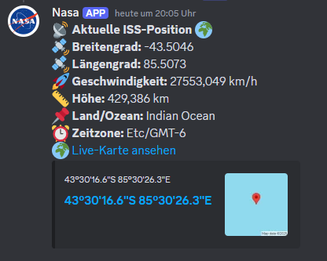
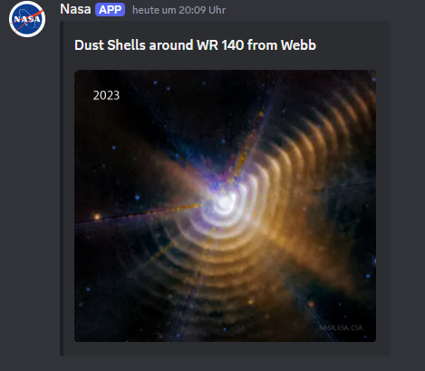
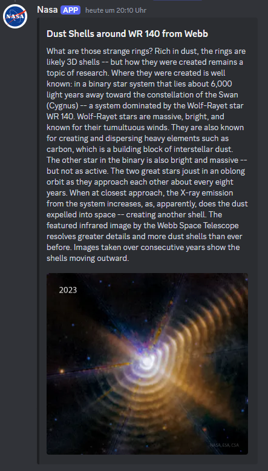
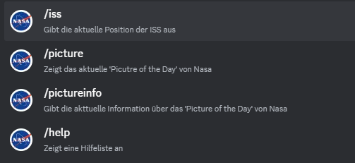

# 🛰 StarLinker

Ein Discord-Bot mit Unterstützung für NASA-APIs, ISS-Tracking, bald auch Mars-Wetterdaten, nahe Erdobjekte und Daten über Exoplaneten.

## Funktionen

- **ISS-Tracking**: Ermittelt die aktuelle Position, Geschwindigkeit und Höhe der Internationalen Raumstation (ISS).

  

- **NASA Astronomy Picture of the Day**: Zeigt das aktuelle NASA-Bild des Tages.

  

- **NASA Astronomy Picture of the Day with Info**: Zeigt das aktuelle NASA-Bild des Tages mit der jeweiligen Beschreibung.

  

- **Slash Commands**: Unterstützt moderne Discord-Slash-Befehle.

   

## Installation

### Voraussetzungen

- Java 17+
- Maven
- Ein Discord-Bot-Token

### Einrichtung

1. Repository klonen:
   ```sh
   git clone https://github.com/jantrw/discord-bot.git
   cd discord-bot
   ```
2. `.env` Datei mit den API-Schlüsseln und dem Discord-Token erstellen:
   ```env
   DISCORD_TOKEN=your_token_here
   NASA_API_KEY=your_nasa_api_key_here
   USERNAME=your_username
   ```
3. Mit Maven bauen und starten:
   ```sh
   mvn package
   java -jar target/discord-bot.jar
   ```

## Nutzung

### Verfügbare Befehle

| Befehl                   | Beschreibung                                |
| ------------------------ | ------------------------------------------- |
| `/iss`                   | Zeigt aktuelle ISS-Daten                    |
| `/picture`               | Zeigt das NASA Astronomy Picture of the Day |
| `/pictureinfo`           | Zeigt das NASA Astronomy Picture mit Info   |
| `/prefix <neues Präfix>` | Ändert das Befehlspräfix                    |

## Architektur

Die Kernklassen des Bots:

- `DiscordBot.java` – Startet den Bot und registriert Befehle.
- `BotListener.java` – Verarbeitet Nachrichten und Slash-Befehle.
- `GuildDataManager.java` – Speichert Guild-spezifische Daten.
- `ISSData.java` – Sendet die ISS-Daten als Discord-Nachricht.
- `NasaPictureOfTheDay.java` – Sendet das NASA Astronomy Picture of the Day als Discord-Nachricht.
- `JSONFetcherIss.java` – Holt aktuelle ISS-Daten von einer API.
- `JSONFetcherNasa.java` – Holt das NASA-Bild des Tages.

## Lizenz

MIT License

