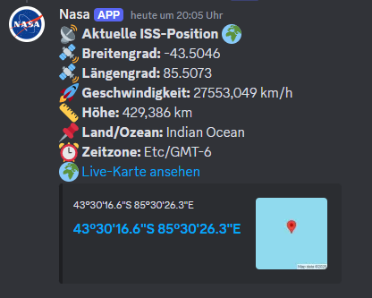
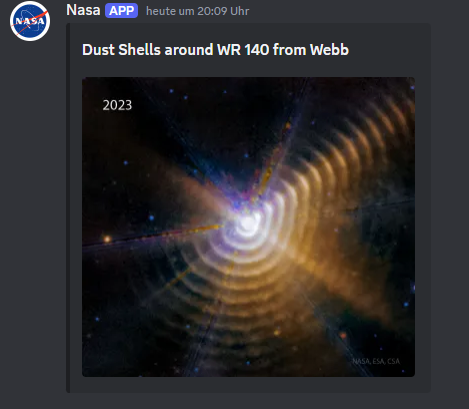
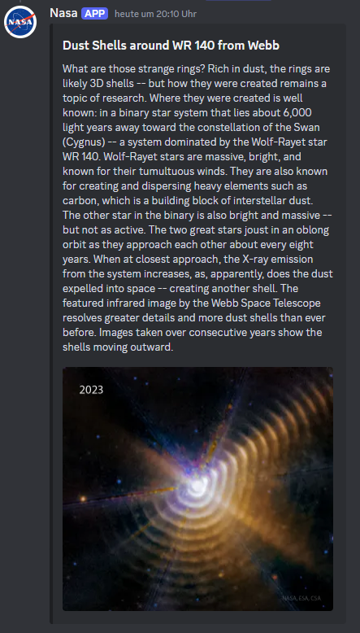

# SpaceLinker

Ein Discord-Bot, der Menschen mit dem Weltraum verbindet – mit Echtzeit-ISS-Tracking und dem Astronomy Picture of the Day von der NASA.

## Funktionen

- **ISS-Tracking** — Echtzeit-Position, Geschwindigkeit, Höhe, Land, Stadt, Zeitzone und Kartenlink
- **NASA Bild des Tages** — Tägliches Astronomiebild mit Titel
- **NASA Bild des Tages + Info** — Tägliches Astronomiebild mit vollständiger Beschreibung
- **Slash-Commands** — Moderne Discord-Slash-Befehle

### Screenshots

| ISS-Tracking | NASA APOD | NASA APOD + Info |
|:---:|:---:|:---:|
|  |  |  |

## Voraussetzungen

- **Java 21+**
- **Maven 3.8+**
- **Discord-Bot-Token** — [Discord Developer Portal](https://discord.com/developers/applications)
- **NASA-API-Key** — [api.nasa.gov](https://api.nasa.gov/) (kostenlos, oder `DEMO_KEY` für eingeschränkten Zugriff)
- **GeoNames-Benutzername** — [geonames.org](https://www.geonames.org/) (kostenloses Konto, für Ozean-Erkennung)

## Einrichtung

### 1. Repository klonen

```sh
git clone https://github.com/jantrw/SpaceLinker.git
cd SpaceLinker
```

### 2. Konfigurationsdatei erstellen

Die Beispielkonfiguration kopieren und API-Schlüssel eintragen:

```sh
cp src/main/resources/config.properties.example src/main/resources/config.properties
```

`src/main/resources/config.properties` bearbeiten:

```properties
# NASA API-Key — kostenlos unter https://api.nasa.gov/
apiKeyNasa=DEIN_NASA_API_KEY

# Discord-Bot-Token — unter https://discord.com/developers/applications
botToken=DEIN_DISCORD_BOT_TOKEN

# GeoNames-Benutzername — Registrierung unter https://www.geonames.org/
username=DEIN_GEONAMES_BENUTZERNAME
```

> **Hinweis:** `config.properties` steht in `.gitignore` und wird nicht committed.

### 3. Discord-Bot erstellen

1. Zum [Discord Developer Portal](https://discord.com/developers/applications) gehen
2. **New Application** klicken → Namen vergeben
3. Zu **Bot** gehen → **Add Bot** klicken
4. **Token** kopieren und in `config.properties` eintragen (`botToken`)

### 4. Bot zum Server einladen

`DEINE_CLIENT_ID` durch die Client-ID der Anwendung ersetzen (unter General Information zu finden):

```
https://discord.com/oauth2/authorize?client_id=DEINE_CLIENT_ID&scope=bot&permissions=274877991936
```

Dies gewährt: Nachrichten senden, Links einbetten, Slash-Commands verwenden.

### 5. Bauen und starten

```sh
mvn clean package
java -jar target/SpaceLinker-1.0-SNAPSHOT.jar
```

Oder direkt mit Maven starten:

```sh
mvn compile exec:java -Dexec.mainClass="me.jan_dev.DiscordBot"
```

### 6. Slash-Commands registrieren

Beim ersten Start registriert der Bot die Slash-Commands automatisch bei Discord. Bei nachfolgenden Starts wird die Registrierung übersprungen, sofern sich die Commands nicht geändert haben.

## Verfügbare Befehle

| Befehl | Beschreibung |
|--------|-------------|
| `/iss` | Aktuelle ISS-Position, Geschwindigkeit, Höhe, Standort und Kartenlink |
| `/picture` | NASA Astronomy Picture of the Day (nur Bild) |
| `/pictureinfo` | NASA Astronomy Picture of the Day mit vollständiger Beschreibung |
| `/help` | Zeigt diese Befehlsliste |

## Projektstruktur

```
src/main/java/
├── me/jan_dev/
│   ├── DiscordBot.java          # Einstiegspunkt, Bot-Setup, Command-Registrierung
│   └── BotListener.java         # /help Slash-Command-Handler
├── commands/
│   ├── ISSData.java             # /iss Befehl — baut das ISS-Embed
│   ├── JSONFetcherIss.java      # Holt ISS-Daten von mehreren APIs
│   ├── NasaPictureOfTheDay.java # /picture und /pictureinfo Befehle
│   └── NasaCommandHandler.java  # Holt NASA APOD-Daten
└── data/
    ├── Config.java              # Lädt config.properties aus dem Classpath
    └── Http.java                # Gemeinsame HttpClient-Instanz
```

## Verwendete APIs

| API | Verwendung | Ratenlimit |
|-----|-----------|------------|
| [Open Notify](http://open-notify.org/Open-Notify-API/ISS-Location-Now/) | ISS-Position | Kein angegebenes Limit |
| [Where is the ISS](https://wheretheiss.at/w/Developer) | ISS-Geschwindigkeit, Höhe, Zeitzone | Großzügig |
| [Nominatim](https://nominatim.org/release-docs/latest/api/Overview/) | Reverse Geocoding (Land, Stadt) | 1 Anfrage/Sekunde |
| [GeoNames](https://www.geonames.org/export/web-services.html) | Ozean-Erkennung | 1000/Tag (kostenlos) |
| [NASA APOD](https://api.nasa.gov/) | Astronomy Picture of the Day | 1000/Stunde (mit Key) |

## Tech-Stack

- **[JDA 5.2.2](https://github.com/DV8FromTheWorld/JDA)** — Java Discord API
- **[Gson 2.10.1](https://github.com/google/gson)** — JSON-Verarbeitung
- **[SLF4J](https://www.slf4j.org/) + slf4j-simple** — Logging

## Lizenz

MIT License
